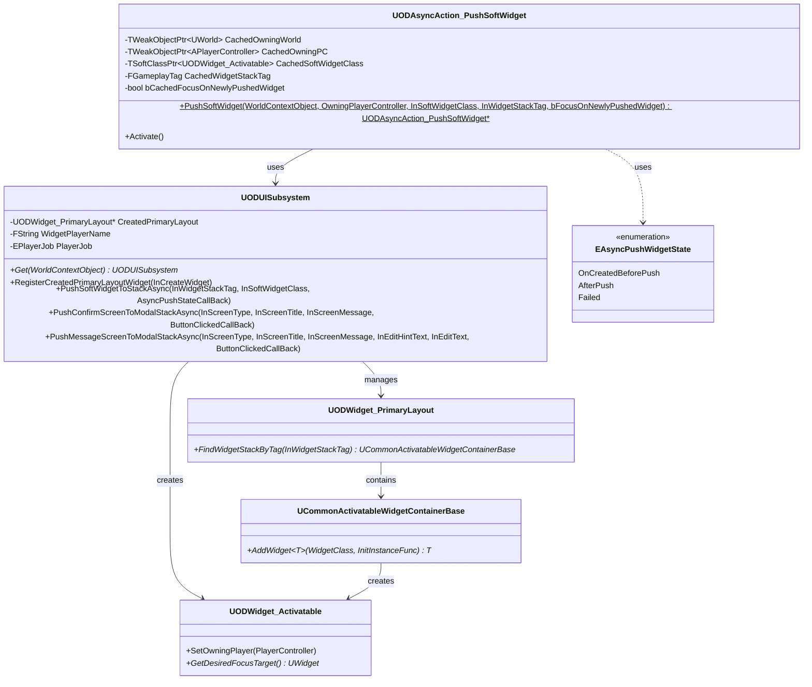
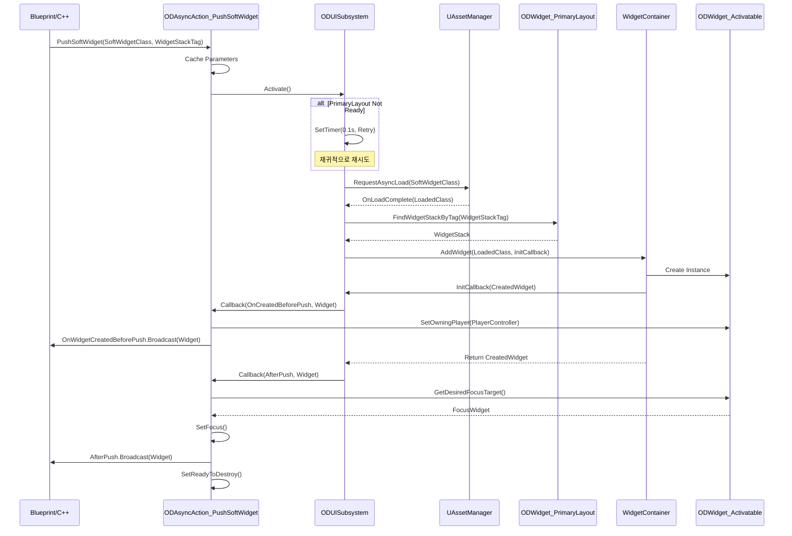
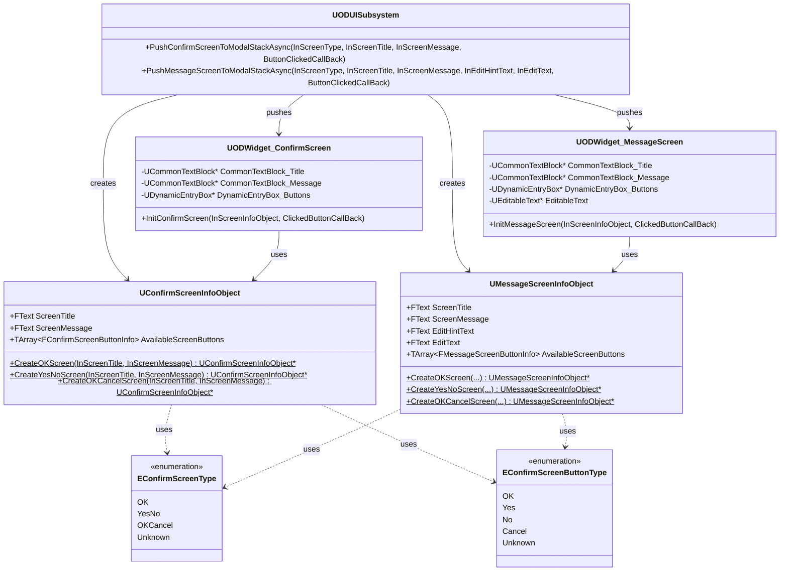
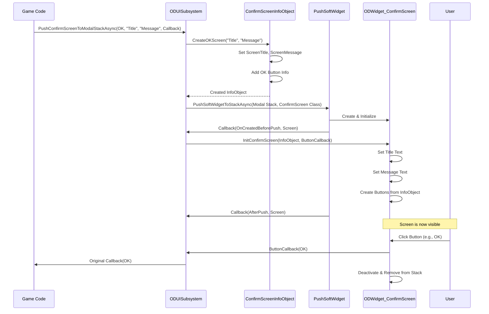
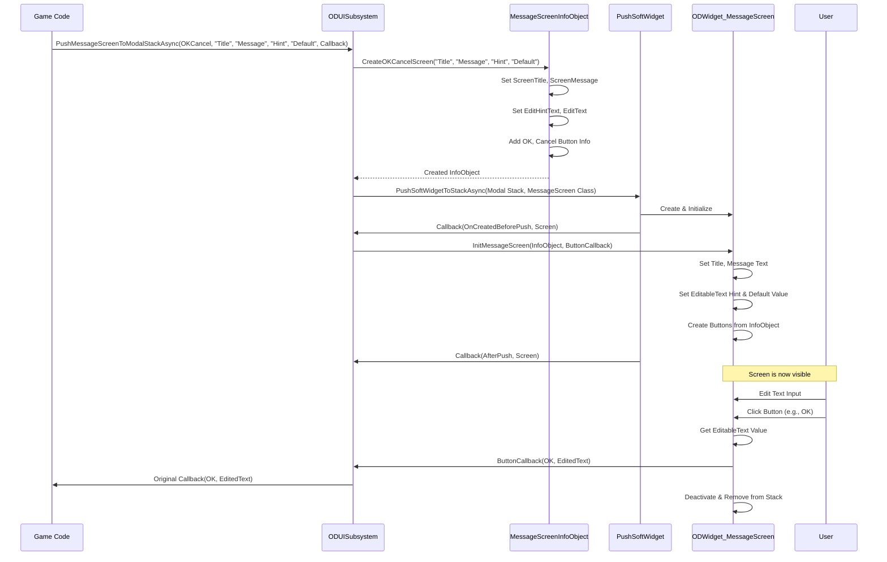
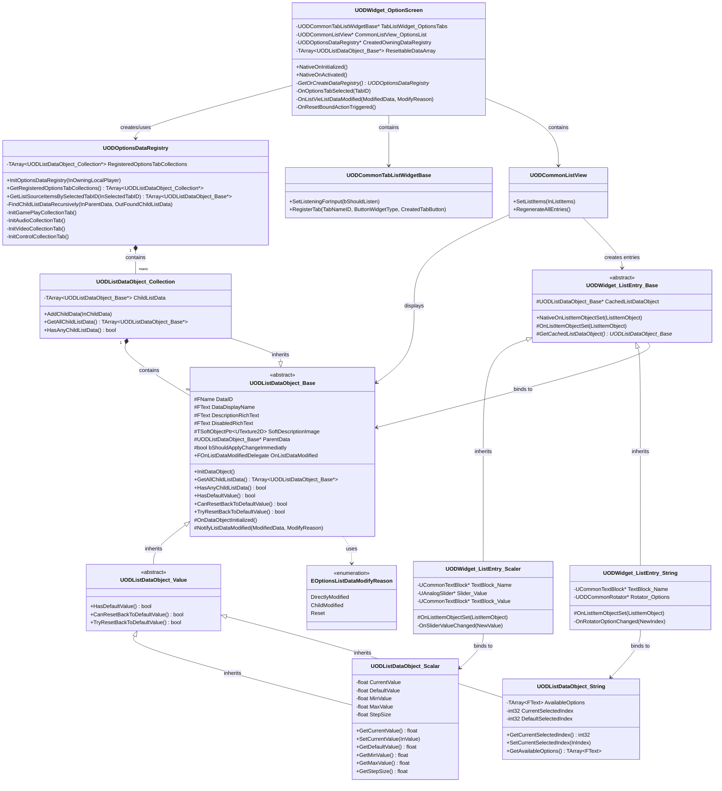
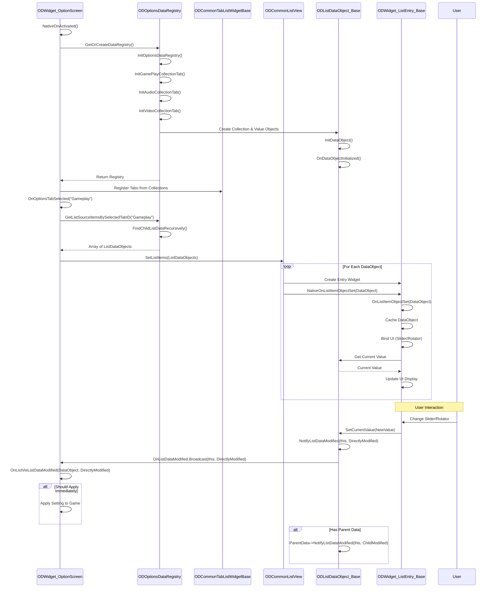

# ODIN: VALHALLA RISING - UI System Portfolio

## 📑 목차 (Table of Contents)

- [📋 프로젝트 개요](#-프로젝트-개요)
  - [개발 동기 및 목표](#개발-동기-및-목표)
- [🎯 주요 역할 및 성과](#-주요-역할-및-성과)
- [🏗️ UI 시스템 아키텍처](#️-ui-시스템-아키텍처)
  - [1. UI Subsystem](#1-ui-subsystem-oduisubsystem)
  - [2. 위젯 계층 구조](#2-위젯-계층-구조)
  - [3. 위젯 Stack Push 시스템](#3-위젯-stack-push-시스템)
  - [4. Confirmation & Message Screen 시스템](#4-confirmation--message-screen-시스템)
  - [5. Data Registry & List Management 시스템](#5-data-registry--list-management-시스템)
- [💡 주요 구현 내용](#-주요-구현-내용)
  - [1. HUD 시스템](#1-hud-시스템-odwidget_hud)
  - [2. 스킬 시스템 UI](#2-스킬-시스템-ui-odwidget_skillscreen)
  - [3. 옵션 설정 UI](#3-옵션-설정-ui-odwidget_optionscreen)
  - [4. 데미지 텍스트 시스템](#4-데미지-텍스트-시스템)
  - [5. 공통 컴포넌트](#5-공통-컴포넌트)
- [🎮 핵심 제작 UI 상세](#-핵심-제작-ui-상세)
  - [메인 화면](#메인-화면)
  - [캐릭터 선택](#캐릭터-선택)
  - [POPUP 메뉴](#popup-메뉴)
  - [HUD UI](#hud-ui)
  - [설정](#설정)
  - [데미지 POPUP](#데미지-popup)
  - [타겟팅](#타겟팅)
  - [스킬창 및 스킬슬롯](#스킬창-및-스킬슬롯)
- [🔧 기술 스택 및 패턴](#-기술-스택-및-패턴)
- [📊 성능 최적화](#-성능-최적화)
- [🎨 UI/UX 특징](#-uiux-특징)
- [📝 코드 구조](#-코드-구조)
- [🚀 향후 개선 방향](#-향후-개선-방향)
- [📚 학습 및 성장](#-학습-및-성장)
- [📞 연락처](#-연락처)

---

## 📋 프로젝트 개요

**프로젝트명**: ODIN: VALHALLA RISING  
**엔진**: Unreal Engine 5.4 (Dedicated Server)  
**장르**: MMORPG  
**담당 파트**: UI 시스템 / 기능 / 연출  
**개발 기간**: [기간 입력]

### 개발 동기 및 목표

#### 배경
이전 프로젝트에서 전투 및 기능적 로직을 주로 담당했기에, 이번 프로젝트에서는 **전문적이고 높은 퀄리티의 UI**를 구현하는 것을 목표로 삼았습니다.

#### 핵심 목표
1. **전문화된 UI 시스템 구축**
   - 단순한 기능 구현을 넘어선 전문적인 UI 아키텍처 설계
   - 산업 표준에 부합하는 UI 개발 경험 축적

2. **모듈화 및 최적화**
   - 재사용 가능한 모듈화된 UI 컴포넌트 설계
   - 메모리 및 렌더링 최적화를 고려한 시스템 구현

3. **크로스 플랫폼 대응**
   - PC와 모바일 환경 모두 지원
   - Epic Games의 **CommonUI 플러그인** 활용
   - 다양한 입력 디바이스(키보드, 마우스, 게임패드, 터치) 지원

#### CommonUI 선택 이유
- **크로스 플랫폼 최적화**: Epic Games가 공식 지원하는 크로스 플랫폼 UI 프레임워크
- **입력 추상화**: 다양한 입력 방식을 통합적으로 처리
- **스택 관리**: 체계적인 UI 레이어 및 포커스 관리
- **산업 표준**: Fortnite 등 대규모 프로젝트에서 검증된 솔루션

---

## 🎯 주요 역할 및 성과

### UI 아키텍처 설계
- **CommonUI 프레임워크 기반** UI 시스템 구축
- **모듈화된 위젯 구조** 설계로 재사용성 및 유지보수성 향상
- **비동기 위젯 로딩 시스템** 구현으로 메모리 최적화
- **GameplayTag 기반 위젯 관리** 시스템 구현

### 핵심 시스템 구현
- ✅ 메인 화면 및 캐릭터 선택 시스템
- ✅ HUD 시스템 (체력/마나/경험치 게이지, 레벨업 알림)
- ✅ 스킬 관리 UI (액티브/패시브 스킬, 슬롯 변경, 등급별 시각화)
- ✅ 옵션 설정 UI (그래픽/사운드/게임플레이 설정, INI 파일 저장)
- ✅ POPUP 시스템 (확인/메시지 다이얼로그)
- ✅ 데미지 텍스트 시스템 (플레이어/몬스터)
- ✅ 타겟팅 시스템 (Auto/Select/Click Target)
- ✅ 던전 입장 UI

### 기술적 성과
- **Data Registry 패턴**: 중앙 집중식 데이터 관리로 메모리 효율성 향상
- **List Data Object 분리**: UI와 데이터 독립성 확보
- **비동기 로딩**: TSoftClassPtr 활용한 지연 로딩으로 초기 메모리 사용량 최소화
- **크로스 플랫폼 입력**: PC/모바일 환경 모두 지원하는 통합 입력 시스템

---

## 🏗️ UI 시스템 아키텍처

### 1. UI Subsystem (ODUISubsystem)
게임 인스턴스 레벨의 UI 관리 시스템

```cpp
class UODUISubsystem : public UGameInstanceSubsystem
{
    // 비동기 위젯 푸시 시스템
    void PushSoftWidgetToStackAsync(
        const FGameplayTag& InWidgetStackTag,
        TSoftClassPtr<UODWidget_Activatable> InSoftWidgetClass,
        TFunction<void(EAsyncPushWidgetState, UODWidget_Activatable*)> AsyncPushStateCallBack
    );
    
    // 확인 다이얼로그 시스템
    void PushConfirmScreenToModalStackAsync(
        EConfirmScreenType InScreenType,
        const FText& InScreenTitle,
        const FText& InScreenMessage,
        TFunction<void(EConfirmScreenButtonType)> ButtonClickedCallBack
    );
};
```

**주요 기능**:
- 위젯 라이프사이클 관리
- 비동기 위젯 로딩 및 스택 관리
- 플레이어 정보 캐싱 (이름, 직업)
- 모달 다이얼로그 시스템

### 2. 위젯 계층 구조

```
UCommonActivatableWidget (Epic Games CommonUI)
    └── UODWidget_Activatable (베이스 위젯)
        ├── UODWidget_HUD (메인 HUD)
        ├── UODWidget_SkillScreen (스킬 관리)
        ├── UODWidget_OptionScreen (옵션 설정)
        ├── UODWidget_Dungeon (던전 입장)
        ├── UODWidget_ConfirmScreen (확인 다이얼로그)
        └── UODWidget_MessageScreen (메시지 입력)
```

### 3. 위젯 Stack Push 시스템

#### 시스템 개요
비동기 위젯 로딩과 스택 관리를 통해 메모리 효율성과 사용자 경험을 동시에 달성하는 시스템입니다.

#### 클래스 다이어그램



#### 위젯 Push 프로세스 시퀀스 다이어그램



#### 주요 특징

**1. 비동기 로딩**
```cpp
// TSoftClassPtr를 사용한 지연 로딩
UAssetManager::Get().GetStreamableManager().RequestAsyncLoad(
    InSoftWidgetClass.ToSoftObjectPath(),
    FStreamableDelegate::CreateLambda([...](){ /* 로딩 완료 후 처리 */ })
);
```
- 초기 메모리 사용량 최소화
- 로딩 중 게임 플레이 중단 없음
- 필요한 시점에만 위젯 클래스 로드

**2. 안전한 재시도 메커니즘**
```cpp
// PrimaryLayout이 준비되지 않은 경우 재시도
TWeakObjectPtr<UODUISubsystem> WeakThis(this);
GetWorld()->GetTimerManager().SetTimer(TimerHandle, [WeakThis, ...](){ 
    if (WeakThis.IsValid()) {
        WeakThis->PushSoftWidgetToStackAsync(...);
    }
}, 0.1f, false);
```
- WeakObjectPtr로 안전한 참조 관리
- 타이머를 통한 자동 재시도
- 메모리 누수 방지

**3. 콜백 기반 상태 알림**
```cpp
enum class EAsyncPushWidgetState : uint8 {
    OnCreatedBeforePush,  // 위젯 생성 직후, Push 전
    AfterPush,            // Push 완료 후
    Failed                // 실패
};
```
- 생성 단계별 커스터마이징 가능
- 블루프린트에서 이벤트 처리 가능
- 에러 핸들링 지원

---

### 4. Confirmation & Message Screen 시스템

#### 시스템 개요
모달 다이얼로그 시스템으로 사용자 확인, 메시지 입력 등을 처리합니다.

#### 클래스 다이어그램



#### Confirmation Screen Push 프로세스



#### Message Screen Push 프로세스



#### 주요 특징

**1. 팩토리 패턴**
```cpp
// 타입별 InfoObject 생성
UConfirmScreenInfoObject* InfoObject = nullptr;
switch (InScreenType) {
    case EConfirmScreenType::OK:
        InfoObject = UConfirmScreenInfoObject::CreateOKScreen(Title, Message);
        break;
    case EConfirmScreenType::YesNo:
        InfoObject = UConfirmScreenInfoObject::CreateYesNoScreen(Title, Message);
        break;
    // ...
}
```
- 타입 안전한 스크린 생성
- 일관된 버튼 구성
- 확장 가능한 구조

**2. 동적 버튼 생성**
```cpp
// DynamicEntryBox를 사용한 런타임 버튼 생성
UPROPERTY(meta = (BindWidget))
TObjectPtr<UDynamicEntryBox> DynamicEntryBox_Buttons;
```
- 버튼 개수 동적 조정
- 타입별 다른 버튼 구성
- 메모리 효율적

**3. 람다 콜백 체인**
```cpp
PushSoftWidgetToStackAsync(
    UITags::OD_WidgetStack_Modal,
    ConfirmScreenClass,
    [InfoObject, ButtonClickedCallBack](EAsyncPushWidgetState State, UODWidget_Activatable* Widget) {
        if (State == EAsyncPushWidgetState::OnCreatedBeforePush) {
            auto* Screen = CastChecked<UODWidget_ConfirmScreen>(Widget);
            Screen->InitConfirmScreen(InfoObject, ButtonClickedCallBack);
        }
    }
);
```
- 비동기 처리와 초기화 분리
- 타입 안전한 캐스팅
- 클로저를 통한 데이터 전달

---

### 5. Data Registry & List Management 시스템

#### 시스템 개요
옵션 설정과 스킬 시스템에서 사용하는 데이터 중앙 관리 및 리스트 UI 바인딩 시스템입니다.

#### 클래스 다이어그램



#### 데이터 흐름 및 업데이트 프로세스



#### 주요 특징

**1. 계층적 데이터 구조**
```cpp
// Collection은 여러 Data Object를 포함
class UODListDataObject_Collection : public UODListDataObject_Base {
    TArray<UODListDataObject_Base*> ChildListData;
};

// 재귀적으로 모든 자식 데이터 수집
void FindChildListDataRecursively(
    UODListDataObject_Base* InParentData,
    TArray<UODListDataObject_Base*>& OutFoundChildListData
) const;
```
- 탭별 설정 그룹화
- 중첩된 설정 지원
- 효율적인 데이터 탐색

**2. 옵저버 패턴**
```cpp
// 데이터 변경 시 자동 알림
DECLARE_MULTICAST_DELEGATE_TwoParams(
    FOnListDataModifiedDelegate,
    UODListDataObject_Base*,
    EOptionsListDataModifyReason
)
FOnListDataModifiedDelegate OnListDataModified;

// 변경 알림
void NotifyListDataModified(
    UODListDataObject_Base* ModifiedData,
    EOptionsListDataModifyReason ModifyReason
) {
    OnListDataModified.Broadcast(ModifiedData, ModifyReason);
    if (ParentData) {
        ParentData->NotifyListDataModified(ModifiedData, EOptionsListDataModifyReason::ChildModified);
    }
}
```
- 데이터 변경 자동 감지
- UI 자동 업데이트
- 부모-자식 관계 전파

**3. 타입별 Entry Widget 매핑**
```cpp
// ListView가 자동으로 적절한 Entry Widget 생성
// Scalar Data -> Slider Entry
// String Data -> Rotator Entry

class UODWidget_ListEntry_Scaler : public UODWidget_ListEntry_Base {
    void OnListItemObjectSet(UObject* ListItemObject) override {
        auto* ScalarData = Cast<UODListDataObject_Scalar>(ListItemObject);
        Slider_Value->SetValue(ScalarData->GetCurrentValue());
    }
};
```
- 데이터 타입에 따른 자동 UI 생성
- 타입 안전성 보장
- 확장 가능한 구조

**4. 설정 초기화 시스템**
```cpp
// 기본값 복원 기능
virtual bool HasDefaultValue() const { return false; }
virtual bool CanResetBackToDefaultValue() const { return false; }
virtual bool TryResetBackToDefaultValue() { return false; }

// Scalar 구현
bool UODListDataObject_Scalar::TryResetBackToDefaultValue() {
    if (CurrentValue != DefaultValue) {
        SetCurrentValue(DefaultValue);
        NotifyListDataModified(this, EOptionsListDataModifyReason::Reset);
        return true;
    }
    return false;
}
```
- 개별 설정 초기화
- 카테고리별 일괄 초기화
- 변경 사항 추적

**5. 즉시 적용 vs 지연 적용**
```cpp
void SetShouldApplySettingImmediately(bool bShouldApplyRightAway) {
    bShouldApplyChangeImmediatly = bShouldApplyRightAway;
}

// 설정 변경 시
void OnListVieListDataModified(
    UODListDataObject_Base* ModifiedData,
    EOptionsListDataModifyReason ModifyReason
) {
    if (ModifiedData->ShouldApplyChangeImmediatly()) {
        ApplySettingToGame(ModifiedData);
    } else {
        // 확인 버튼 클릭 시 일괄 적용
    }
}
```
- 그래픽 설정: 확인 버튼 클릭 시 적용
- 사운드 볼륨: 즉시 적용
- 사용자 경험 최적화

---

## 💡 주요 구현 내용

### 1. HUD 시스템 (ODWidget_HUD)

#### 기능
- **실시간 스탯 표시**: HP, MP, EXP 게이지
- **레벨 정보**: 현재 레벨 및 경험치 표시
- **레벨업 알림**: 애니메이션 효과와 함께 레벨업 표시
- **사용자 입력 UI**: 스킬 단축키 및 인터랙션 버튼

#### 기술적 특징
```cpp
// GAS(Gameplay Ability System)와 연동
void OnLevelChanged(const FOnAttributeChangeData& ChangeData);
void OnExpChanged(const FOnAttributeChangeData& ChangeData);

// 위젯 바인딩을 통한 자동 업데이트
UPROPERTY(meta = (BindWidget))
TObjectPtr<UODHudGauge> HPGauge;
```

- **Gameplay Ability System 통합**: 어트리뷰트 변경 시 자동 UI 업데이트
- **위젯 바인딩**: UMG 디자이너와 C++ 코드 간 자동 연결
- **메모리 최적화**: WeakObjectPtr 사용으로 순환 참조 방지

### 2. 스킬 시스템 UI (ODWidget_SkillScreen)

#### 기능
- **탭 기반 스킬 분류**: 액티브/패시브 스킬 분리
- **스킬 상세 정보**: 설명, 쿨타임, 마나 소모량 표시
- **스킬 슬롯 관리**: 드래그 앤 드롭으로 스킬 슬롯 변경
- **스킬 해금 시스템**: 레벨 요구사항 및 해금 애니메이션

#### 기술적 특징
```cpp
// 데이터 레지스트리 패턴
UODSkillsDataRegistry* GetOrCreateSkillDataRegistry();

// 리스트 뷰 이벤트 처리
void OnListViewItemHovered(UObject* InHoveredItem, bool bWasHovered);
void OnListViewItemSelected(UObject* InSelectedItem);
void OnListViewItemClicked(UObject* InClickedItem);
```

- **데이터 레지스트리 패턴**: 스킬 데이터의 중앙 집중식 관리
- **CommonUI ListView**: 최적화된 리스트 렌더링
- **위젯 애니메이션**: 블루프린트 애니메이션과 C++ 연동

### 3. 옵션 설정 UI (ODWidget_OptionScreen)

#### 기능
- **탭 기반 설정 분류**: 그래픽, 사운드, 게임플레이
- **다양한 입력 타입**: 슬라이더, 드롭다운, 토글
- **설정 초기화**: 카테고리별 또는 전체 초기화
- **실시간 적용**: 설정 변경 시 즉시 반영

#### 기술적 특징
```cpp
// 데이터 수정 추적
void OnListVieListDataModified(
    UODListDataObject_Base* ModifiedData,
    EOptionsListDataModifyReason ModifyReason
);

// 입력 액션 바인딩
FUIActionBindingHandle ResetActionHandle;
```

- **옵저버 패턴**: 설정 변경 시 자동 알림
- **입력 액션 시스템**: CommonUI 입력 바인딩 활용
- **데이터 객체 패턴**: 설정값의 타입 안전성 보장

### 4. 데미지 텍스트 시스템

#### 구성 요소
- **ODWidget_DamageQueContainer**: 데미지 텍스트 풀 관리
- **ODWidget_DamageQuePlayer**: 플레이어 데미지 표시
- **ODWidget_DamageQueMonster**: 몬스터 데미지 표시
- **ODWidget_DamageText**: 개별 데미지 텍스트 위젯

#### 기술적 특징
- **오브젝트 풀링**: 위젯 재사용으로 성능 최적화
- **월드 스페이스 UI**: 3D 공간에 2D UI 배치
- **애니메이션 큐**: 순차적 데미지 표시

### 5. 공통 컴포넌트

#### ODCommonTabListWidgetBase
- 탭 전환 시스템
- 선택된 탭 상태 관리
- 탭 변경 이벤트 브로드캐스트

#### ODCommonListView
- 가상화된 리스트 렌더링
- 아이템 선택/호버 이벤트
- 동적 아이템 추가/제거

#### ODCommonButtonBase
- 일관된 버튼 스타일
- 사운드 효과 통합
- 입력 액션 바인딩

---

## 🔧 기술 스택 및 패턴

### 사용 기술
- **Unreal Engine 5.4**
- **CommonUI Plugin**: Epic Games의 크로스플랫폼 UI 프레임워크
- **UMG (Unreal Motion Graphics)**: UI 디자인 및 애니메이션
- **Gameplay Ability System (GAS)**: 게임플레이 로직과 UI 연동
- **Gameplay Tags**: UI 스택 및 상태 관리

### 디자인 패턴
- **Subsystem Pattern**: 게임 인스턴스 레벨의 UI 관리
- **Observer Pattern**: 데이터 변경 시 UI 자동 업데이트
- **Object Pooling**: 데미지 텍스트 등 반복 생성 위젯 최적화
- **Registry Pattern**: 스킬 및 옵션 데이터 중앙 관리
- **Async Loading**: 비동기 위젯 로딩으로 로딩 시간 최소화

---

## 📊 성능 최적화

### 메모리 관리
- **비동기 위젯 로딩**: TSoftClassPtr 사용으로 초기 메모리 사용량 감소
- **WeakObjectPtr 활용**: 순환 참조 방지 및 메모리 누수 차단
- **오브젝트 풀링**: 빈번히 생성/파괴되는 위젯 재사용

### 렌더링 최적화
- **가상화된 리스트**: CommonListView로 대량 아이템 효율적 렌더링
- **위젯 바인딩**: 불필요한 Tick 이벤트 제거
- **조건부 렌더링**: 비활성 위젯의 렌더링 비용 최소화

---

## 🎨 UI/UX 특징

### 사용자 경험
- **직관적인 네비게이션**: 탭 기반 메뉴 구조
- **즉각적인 피드백**: 버튼 클릭, 호버 효과
- **명확한 정보 전달**: 아이콘, 색상, 애니메이션 활용
- **접근성 고려**: 키보드/게임패드 지원 (CommonUI)

### 비주얼 디자인
- **일관된 디자인 시스템**: 공통 컴포넌트 활용
- **애니메이션 효과**: 레벨업, 스킬 해금 등 주요 이벤트
- **색상 코딩**: HP(빨강), MP(파랑), EXP(노랑) 등 직관적 색상

---

## 📝 코드 구조

### 디렉토리 구조
```
Source/OD/
├── Public/
│   ├── Subsystem/
│   │   └── ODUISubsystem.h
│   ├── Widgets/
│   │   ├── ODWidget_Activatable.h (베이스 클래스)
│   │   ├── ODWidget_PrimaryLayout.h
│   │   ├── HUD/
│   │   │   ├── ODWidget_HUD.h
│   │   │   ├── ODWidget_LevelUp.h
│   │   │   └── UserInput/
│   │   ├── Skills/
│   │   │   ├── ODWidget_SkillScreen.h
│   │   │   ├── ODWidget_SkillsDetailsView.h
│   │   │   ├── ListEntries/
│   │   │   └── Slots/
│   │   ├── Options/
│   │   │   ├── ODWidget_OptionScreen.h
│   │   │   └── ListEntries/
│   │   ├── Component/
│   │   │   ├── ODCommonTabListWidgetBase.h
│   │   │   ├── ODCommonListView.h
│   │   │   └── ODCommonButtonBase.h
│   │   └── NoneStackWidget/
│   │       ├── ODWidget_DamageQueContainer.h
│   │       ├── ODWidget_DamageText.h
│   │       └── ODWidget_Target.h
│   └── Enum/
│       └── ODUIEnumTypes.h
└── Private/
    └── (구현 파일들)
```

---

## 🎮 핵심 제작 UI 상세

이 섹션에서는 실제 구현한 UI들의 상세 내용과 구현 방식을 설명합니다.

---

### 메인 화면

메인 화면은 게임의 첫 인상을 결정하는 중요한 UI입니다.

#### 구현 특징
- 깔끔하고 직관적인 레이아웃
- 애니메이션 효과를 통한 생동감 있는 연출
- CommonUI 기반 입력 처리

---

### 캐릭터 선택

#### 시스템 구조
**Character Select Manager** (Actor 기반)를 맵에 배치하여 캐릭터 선택 프로세스를 관리합니다.

#### 주요 기능
1. **캐릭터 클릭 시 카메라 연출**
   - 선택한 캐릭터로 부드러운 카메라 전환
   - 캐릭터 강조를 위한 카메라 앵글 조정

2. **UI 동적 업데이트**
   - 캐릭터 선택 시 관련 UI 자동 Push
   - 캐릭터 정보 및 스탯 표시

3. **캐릭터 생성 시스템**
   - 사용자 입력 캐릭터 이름 저장
   - 선택한 직업에 따라 DefaultPawn 동적 교체
   - Possess 전에 적절한 Pawn 클래스로 교체하여 생성

#### 기술적 구현
```cpp
// DefaultPawn을 직업에 맞게 교체
void ACharacterSelectManager::CreateCharacterByJob(EPlayerJob SelectedJob, const FString& CharacterName) {
    // 직업별 Pawn 클래스 선택
    TSubclassOf<APawn> PawnClass = GetPawnClassByJob(SelectedJob);
    
    // 기존 DefaultPawn 제거 및 새 Pawn 생성
    // PlayerController->Possess() 호출 전 교체
}
```

---

### POPUP 메뉴

#### 구현된 POPUP 종류

**1. Confirmation Screen (확인 다이얼로그)**
- 간단한 메시지 출력
- 사용자 확인 대기
- Enum 분기를 통한 버튼 개수 조절 (OK, YesNo, OKCancel)

**2. Message Screen (메시지 입력 다이얼로그)**
- 텍스트 입력 기능 포함
- 위젯 비활성화 전 입력 메시지를 CallBack으로 전달
- 동적 버튼 생성 (DynamicEntryBox 활용)

#### 주요 특징
```cpp
// Enum을 통한 버튼 구성 제어
enum class EConfirmScreenType : uint8 {
    OK,        // 확인 버튼만
    YesNo,     // 예/아니오
    OKCancel,  // 확인/취소
    Unknown
};

// 람다를 통한 버튼 클릭 처리
PushConfirmScreenToModalStackAsync(
    EConfirmScreenType::YesNo,
    NSLOCTEXT("UI", "Confirm", "확인"),
    NSLOCTEXT("UI", "Message", "정말 삭제하시겠습니까?"),
    [](EConfirmScreenButtonType ButtonType) {
        if (ButtonType == EConfirmScreenButtonType::Yes) {
            // 삭제 로직 실행
        }
    }
);
```

#### 설계 장점
- **유연성**: Enum 분기로 다양한 버튼 조합 지원
- **재사용성**: 하나의 시스템으로 모든 다이얼로그 처리
- **타입 안전성**: 람다 콜백으로 타입 안전한 결과 처리

---

### HUD UI

#### 크로스 플랫폼 입력 처리

**PC 환경**
- 키보드 단축키로 스킬 및 기능 실행
- 마우스 클릭으로 버튼 상호작용

**모바일 환경**
- 터치 입력으로 버튼 직접 클릭
- 화면 UI 버튼으로 모든 기능 접근 가능

#### 통합 입력 시스템
```cpp
// CommonUI 입력 액션 바인딩
// 키보드와 버튼 클릭 모두 동일한 로직 실행
void UODWidget_Hud_UserInput::BindInputActions() {
    // 키보드 입력
    RegisterUIActionBinding(FBindUIActionArgs(
        AutoAttackAction, 
        FSimpleDelegate::CreateUObject(this, &ThisClass::OnAutoAttackTriggered)
    ));
    
    // 버튼 클릭도 동일한 함수 호출
    AutoAttackButton->OnClicked().AddUObject(this, &ThisClass::OnAutoAttackTriggered);
}
```

#### AUTO 버튼 특수 처리
- **키보드로 활성화** → 버튼 클릭으로 비활성화 가능
- **버튼으로 활성화** → 키보드로 비활성화 가능
- 양방향 입력 모두 지원하여 사용자 편의성 극대화

---

### 설정

#### INI 파일 기반 설정 저장

**UserSettings 시스템 활용**
```cpp
// UGameUserSettings를 상속받아 커스텀 설정 구현
class UODGameUserSettings : public UGameUserSettings {
    UPROPERTY(Config)
    float MasterVolume;
    
    UPROPERTY(Config)
    float MusicVolume;
    
    UPROPERTY(Config)
    float SFXVolume;
    
    // INI 파일에 자동 저장/로드
    virtual void ApplySettings(bool bCheckForCommandLineOverrides) override;
};
```

#### 설정 지속성
- **저장 위치**: `Saved/Config/WindowsClient/GameUserSettings.ini`
- **자동 로드**: 게임 시작 시 INI 파일에서 설정 자동 복원
- **즉시 적용**: 설정 변경 시 실시간 반영 (사운드 볼륨 등)
- **지연 적용**: 그래픽 설정은 확인 버튼 클릭 시 일괄 적용

#### 데이터 흐름
1. 사용자가 설정 변경 (Slider/Rotator 조작)
2. ListDataObject에 값 저장
3. 옵저버 패턴으로 변경 알림
4. 설정 적용 여부 판단 (즉시/지연)
5. UserSettings에 저장
6. INI 파일에 기록

---

### 데미지 POPUP

#### ASC(Ability System Component) 바인딩

**바인딩 타이밍 처리**
```cpp
void UODWidget_DamageQueContainer::NativeConstruct() {
    Super::NativeConstruct();
    
    // ASC가 준비될 때까지 대기
    TryBindToASC();
}

void UODWidget_DamageQueContainer::TryBindToASC() {
    if (UAbilitySystemComponent* ASC = GetOwnerASC()) {
        // Attribute 변경 이벤트 바인딩
        ASC->GetGameplayAttributeValueChangeDelegate(
            UODAttributeSet::GetHealthAttribute()
        ).AddUObject(this, &ThisClass::OnHealthChanged);
    } else {
        // ASC가 아직 준비되지 않음, 재시도
        GetWorld()->GetTimerManager().SetTimerForNextTick(
            this, &ThisClass::TryBindToASC
        );
    }
}
```

#### 데미지 텍스트 표시 구조

**플레이어 데미지 (위에서 삽입)**
```cpp
// VerticalBox를 뒤집고 텍스트도 뒤집어 삽입
// 결과: 최신 데미지가 위에 표시
VerticalBox->SetRenderTransformAngle(180.0f);
UTextBlock* DamageText = CreateDamageText(DamageValue);
DamageText->SetRenderTransformAngle(180.0f);  // 텍스트는 다시 뒤집어 정상 표시
VerticalBox->AddChild(DamageText);
```

**몬스터 데미지 (아래에서 삽입)**
```cpp
// 일반적인 VerticalBox 사용
// 결과: 최신 데미지가 아래에 표시
VerticalBox->AddChild(CreateDamageText(DamageValue));
```

#### 애니메이션 및 풀링
- **페이드 아웃**: 일정 시간 후 텍스트 자동 제거
- **위젯 풀링**: 빈번한 생성/파괴 방지
- **메모리 효율**: 재사용 가능한 텍스트 위젯 풀 관리

---

### 타겟팅

#### 3단계 타겟팅 시스템

**1. Auto Target (자동 타겟)**
- **시각적 표현**: 몬스터 아웃라인 빨간색 발광
- **기능**: 가장 가까운 적 자동 감지
- **용도**: 전투 중 빠른 타겟 전환

**2. Select Target (선택 타겟)**
- **시각적 표현**: 빨간색 타겟 UI 생성
- **HUD 연동**: 몬스터 체력바 HUD에 표시
- **기능**: 특정 몬스터 정보 확인
- **용도**: 전략적 타겟 선택

**3. Click Target (클릭 타겟)**
- **시각적 표현**: 금색 화살표 표시
- **자동 공격**: 타겟 자동 추적 및 공격
- **기능**: 완전 자동 전투 모드
- **용도**: 편의성 중심 플레이

#### 구현 상세
```cpp
// 타겟 타입별 시각화
void ATargetingSystem::UpdateTargetVisualization(AActor* Target, ETargetType TargetType) {
    switch (TargetType) {
        case ETargetType::Auto:
            // 아웃라인 머티리얼 적용
            ApplyOutlineEffect(Target, FLinearColor::Red);
            break;
            
        case ETargetType::Select:
            // 타겟 UI 위젯 생성
            CreateTargetWidget(Target, ETargetWidgetType::Red);
            // HUD에 체력바 표시
            UpdateHUDMonsterInfo(Target);
            break;
            
        case ETargetType::Click:
            // 금색 화살표 위젯 생성
            CreateTargetWidget(Target, ETargetWidgetType::GoldArrow);
            // 자동 공격 시작
            StartAutoAttack(Target);
            break;
    }
}
```

---

### 스킬창 및 스킬슬롯

#### 탭 기반 스킬 분류 시스템

**구조**
- **TabListWidget**: 액티브/패시브 스킬 탭
- **ListView**: 각 탭의 스킬 목록
- **DetailView**: 선택한 스킬의 상세 정보

#### 스킬 등록 시스템

**등록 조건 검증**
```cpp
void UODWidget_SkillScreen::OnSkillSlotClicked(int32 SlotIndex) {
    if (!SelectedSkill) return;
    
    // 스킬 습득 여부 확인
    if (!IsSkillLearned(SelectedSkill->SkillID)) {
        ShowMessage(TEXT("배우지 않은 스킬은 등록할 수 없습니다."));
        return;
    }
    
    // 슬롯에 스킬 등록
    RegisterSkillToSlot(SelectedSkill, SlotIndex);
    
    // HUD 스킬 버튼 업데이트
    UpdateHUDSkillButton(SlotIndex, SelectedSkill);
}
```

#### HUD 스킬 버튼 연동
- **키보드 단축키**: 숫자 키(1-8)로 스킬 발동
- **버튼 클릭**: 마우스/터치로 스킬 사용
- **쿨타임 표시**: 원형 프로그레스 바로 쿨타임 시각화
- **이펙트**: 스킬 사용 시 시각적 피드백

#### 스킬 등급별 시각화

**Data Asset 기반 등급 시스템**
```cpp
USTRUCT()
struct FSkillGradeInfo {
    UPROPERTY(EditAnywhere)
    ESkillGrade Grade;  // Common, Rare, Epic, Legendary
    
    UPROPERTY(EditAnywhere)
    UTexture2D* GradeIcon;  // 등급별 아이콘
    
    UPROPERTY(EditAnywhere)
    FLinearColor GradeColor;  // 등급별 색상
    
    UPROPERTY(EditAnywhere)
    UTexture2D* BackgroundImage;  // 등급별 배경
};
```

**동적 이미지 로딩**
- DA(Data Asset)에 등록된 등급에 따라 다른 이미지 로드
- 비동기 텍스처 로딩으로 성능 최적화
- 등급별 색상 코딩으로 직관적 구분

#### 스킬 Detail View

**표시 정보**
- 스킬 이름 및 등급
- 스킬 아이콘 (등급별 배경)
- 스킬 설명 (Rich Text 지원)
- 마나 소모량
- 쿨타임
- 데미지/효과 수치
- 요구 레벨

**동적 업데이트**
```cpp
void UODWidget_SkillsDetailsView::UpdateSkillDetails(USkillDataObject* SkillData) {
    // 스킬 아이콘 및 배경 설정
    SkillIcon->SetBrushFromTexture(SkillData->GetSkillIcon());
    GradeBackground->SetBrushFromTexture(SkillData->GetGradeBackground());
    GradeBackground->SetColorAndOpacity(SkillData->GetGradeColor());
    
    // 텍스트 정보 업데이트
    SkillNameText->SetText(SkillData->GetSkillName());
    SkillDescriptionText->SetText(SkillData->GetDescription());
    ManaCostText->SetText(FText::AsNumber(SkillData->GetManaCost()));
    CooldownText->SetText(FText::AsNumber(SkillData->GetCooldown()));
}
```

#### 쿨타임 시스템

**시각적 표현**
- **Material Instance Dynamic**: 원형 프로그레스 바
- **실시간 업데이트**: Tick에서 쿨타임 진행도 계산
- **색상 변화**: 쿨타임 중 어두운 색상, 사용 가능 시 밝은 색상

```cpp
void UODWidget_SkillHudActive::UpdateCooldown(float DeltaTime) {
    if (bIsOnCooldown) {
        CurrentCooldownTime -= DeltaTime;
        float CooldownPercent = CurrentCooldownTime / MaxCooldownTime;
        
        // Material Parameter 업데이트
        SkillIconMaterial->SetScalarParameterValue(TEXT("CooldownPercent"), CooldownPercent);
        
        if (CurrentCooldownTime <= 0.0f) {
            bIsOnCooldown = false;
            OnCooldownComplete();
        }
    }
}
```

---

## 🚀 향후 개선 방향

### 계획된 기능
- [ ] 인벤토리 시스템 UI
- [ ] 파티 관리 UI
- [ ] 채팅 시스템
- [ ] 미니맵 및 월드맵
- [ ] 퀘스트 트래커

### 최적화 계획
- [ ] UI 프리로딩 시스템 개선
- [ ] 위젯 풀 크기 동적 조정
- [ ] 렌더링 배치 최적화

---

## 📚 학습 및 성장

### 습득한 기술
- CommonUI 프레임워크의 깊이 있는 이해
- 대규모 UI 시스템 아키텍처 설계 경험
- Gameplay Ability System과 UI 통합
- 비동기 프로그래밍 및 메모리 관리

### 해결한 과제
- **메모리 관리**: 위젯 라이프사이클 최적화로 메모리 누수 방지
- **성능 최적화**: 오브젝트 풀링 및 비동기 로딩으로 프레임 드롭 해결
- **크로스플랫폼 대응**: CommonUI를 활용한 다양한 입력 디바이스 지원

---

## 📞 연락처

- **GitHub**: [Your GitHub]
- **Email**: [Your Email]
- **Portfolio**: [Your Portfolio Website]

---

## 📄 라이선스

이 프로젝트는 포트폴리오 목적으로 작성되었습니다.


